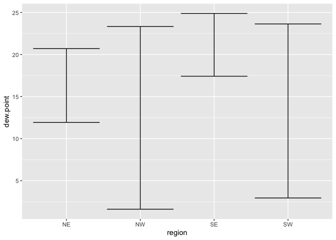
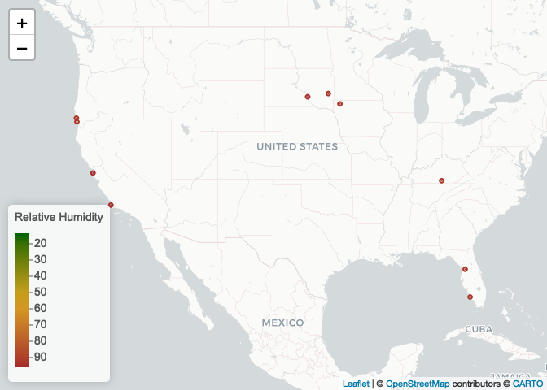

Lab 04
================
Yuhong Hu
2022-09-14

# Read in data

``` r
if (!file.exists("/Users/rain/Desktop/PhD course/pm 566/pm566-fall2022-labs/lab04/met_all.gz"))
  download.file(
    url = "https://raw.githubusercontent.com/USCbiostats/data-science-data/master/02_met/met_all.gz",
    destfile = "met_all.gz",
    method   = "libcurl",
    timeout  = 60
    )
met <- data.table::fread("/Users/rain/Desktop/PhD course/pm 566/pm566-fall2022-labs/lab04/met_all.gz")
```

# Prepare the data

Remove temperatures less than -17C and change elev 9999 to NA

``` r
met <- met[temp > -17][elev == 9999.0,elev := NA]
```

``` r
# Generate a date variable using the functions as.Date() (hint: You will need the following to create a date paste(year, month, day, sep = "-")).
met <- met[,ymd:=as.Date(paste(year,month,day,sep = "-"))]
```

``` r
# Using the data.table::week function, keep the observations of the first week of the month.
met[,table(week(ymd))]
```

    ## 
    ##     31     32     33     34     35 
    ## 371544 520440 529571 526312 369337

``` r
met <- met[week(ymd)==31]

# Compute the mean by station of the variables temp, rh, wind.sp, vis.dist, dew.point, lat, lon, and elev.
met_avg <- met[,.(
  temp = mean(temp,na.rm=TRUE),
  rh = mean(rh,na.rm=TRUE),
  wind.sp = mean(wind.sp,na.rm=TRUE),
  vis.dist = mean(vis.dist,na.rm=TRUE),
  dew.point = mean(dew.point,na.rm=TRUE),
  lat = mean(lat,na.rm=TRUE),
  lon = mean(lon,na.rm=TRUE),
  elev = mean(elev,na.rm=TRUE)
),by = 'USAFID']

# Create a region variable for NW, SW, NE, SE based on lon = -98.00 and lat = 39.71 degrees
met_avg[,region := fifelse(lon >= -98 & lat > 39.71,"NE",
              fifelse(lon < -98 & lat > 39.71,"NW",
              fifelse(lon < -98 & lat <= 39.71,"SW","SE")))]

table(met_avg$region)
```

    ## 
    ##  NE  NW  SE  SW 
    ## 484 146 649 296

``` r
# Create a categorical variable for elevation as in the lecture slides
met_avg[,elev_cat := fifelse(elev>252,'high','low')]
```

# geom_violin

Use geom_violin to examine the wind speed and dew point temperature by
region.

``` r
met_avg[!is.na(region)] %>% 
  ggplot()+
  geom_violin(mapping=aes(y=dew.point, x=1, color=region,fill=region))+
  facet_wrap(~region,nrow=1)
```

<!-- --> The highest
dewpoint was reported in SE.

``` r
met_avg[!is.na(region)&!is.na(wind.sp)] %>% 
  ggplot()+
  geom_violin(mapping=aes(y=wind.sp, x=1, color=region,fill=region))+
  facet_wrap(~region,nrow=2,ncol=2)
```

<!-- -->

# gemo_jitter

Use geom_jitter with geom_smooth to examine the association between dew
point temperature and wind speed by region

``` r
met_avg[!is.na(region)&!is.na(wind.sp)] %>% 
  ggplot(mapping=aes(y=dew.point,x=wind.sp))+
  geom_jitter(mapping=aes(color=region))+
  geom_smooth(method=lm,mapping=aes(linetype=region))+
  facet_wrap(~region,nrow=2)
```

    ## `geom_smooth()` using formula 'y ~ x'

<!-- -->
\# stat_summary

``` r
met_avg[!is.na(dew.point)] %>% 
  ggplot(mapping=aes(x=region,y=dew.point))+
  stat_summary(fun.data=mean_sdl,
               geom='errorbar')
```

<!-- --> \# Spatial
trend in relative humidity in the US (leaflet)

``` r
# Generating a color palette
rh.pal <- colorNumeric(c('darkgreen','goldenrod','brown'), domain=met_avg$rh)
rh.pal
```

    ## function (x) 
    ## {
    ##     if (length(x) == 0 || all(is.na(x))) {
    ##         return(pf(x))
    ##     }
    ##     if (is.null(rng)) 
    ##         rng <- range(x, na.rm = TRUE)
    ##     rescaled <- scales::rescale(x, from = rng)
    ##     if (any(rescaled < 0 | rescaled > 1, na.rm = TRUE)) 
    ##         warning("Some values were outside the color scale and will be treated as NA")
    ##     if (reverse) {
    ##         rescaled <- 1 - rescaled
    ##     }
    ##     pf(rescaled)
    ## }
    ## <bytecode: 0x103b64870>
    ## <environment: 0x103b61fe8>
    ## attr(,"colorType")
    ## [1] "numeric"
    ## attr(,"colorArgs")
    ## attr(,"colorArgs")$na.color
    ## [1] "#808080"

``` r
#Use addMarkers to include the top 10 places in relative h (hint: this will be useful rank(-rh) <= 10)
top10rh <- met_avg[order(-rh)[1:10]]

rhmap <- leaflet(top10rh) %>% 
  # The looks of the Map
  addProviderTiles('CartoDB.Positron') %>% 
  # Some circles
  addCircles(
    lat = ~lat, lng=~lon,
                                                  # HERE IS OUR PAL!
    label = ~paste0(rh), color = ~ rh.pal(rh),
    opacity = 1, fillOpacity = 1, radius = 500
    ) %>%
  # And a pretty legend
  addLegend('bottomleft', pal=rh.pal, values=met_avg$rh,
          title='Relative Humidity', opacity=1)

rhmap
```

<!-- -->
